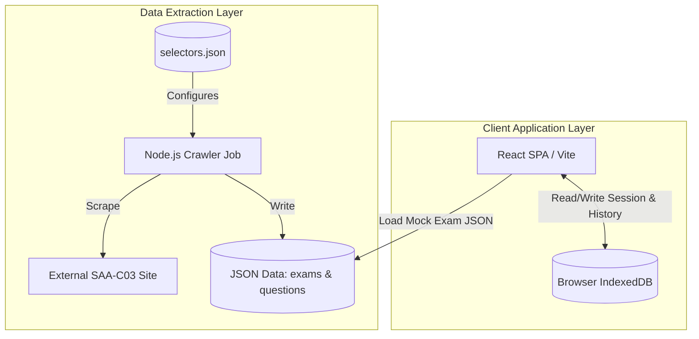
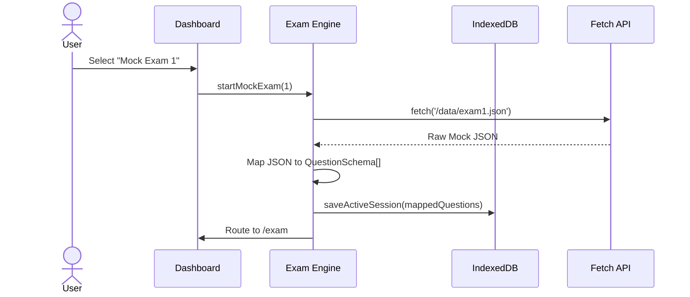

# Technical Design: AWS SAA-C03 Prep System

## Overview
**Purpose**: This feature delivers a fully offline-capable, client-side web application for practicing AWS SAA-C03 certification exams.
**Users**: A single individual learner preparing for the exam.
**Impact**: Creates a local environment where users can take specific mock exams (1 to 6) or random practice exams, review detailed explanations, and track their performance without needing backend services or internet connectivity.

### Goals
- Provide a robust mock exam engine replicating the 65-question / 130-minute SAA-C03 format.
- Allow users to select from 6 specific Mock Exams or a Random Practice Exam.
- Offer immediate feedback and "tricks" for effective learning.
- Ensure progress is saved persistently in the browser.
- Deliver an automated crawler script to seed the question bank.

### Non-Goals
- Multi-user authentication and authorization.
- Cloud synchronization or backup (data stays local to the device).
- Complex backend server infrastructure.

## Architecture

### Architecture Pattern & Boundary Map
**Client-Side SPA with IndexedDB + Offline Scraper**
The system is divided into two distinct boundaries:
1. **Offline Scraper**: A Node.js CLI tool that runs on the user's machine. It uses a `selectors.json` configuration file to fetch questions from a target source and outputs static JSON files (`questions.json` and `examX.json`).
2. **React SPA**: A web application that reads the static JSON files, loads them into IndexedDB (for random practice) or directly into memory (for specific mock exams), and manages all exam logic and progress tracking purely on the client side.



### Technology Stack

| Layer | Choice / Version | Role in Feature | Notes |
|-------|------------------|-----------------|-------|
| Frontend | React + Vite + TypeScript | UI and Exam Logic | Fast build, standard SPA |
| State/Storage | IndexedDB (via `dexie` or `idb`) | Persistent storage | Handles large JSON datasets and exam history without 5MB limits |
| Data Extraction | Node.js + Puppeteer | Web scraping job | Headless browser for dynamic DOM |

## Canonical Contracts & Invariants

| Contract Area | Canonical Decision | Applies To | Must Stay Consistent In |
|---------------|--------------------|------------|-------------------------|
| Data / persistence | IndexedDB is the source of truth for exam history and active session state | Client SPA | All data reads/writes |
| JSON Schema Mapping | The raw `examX.json` files have a different schema than the app's `QuestionSchema`. They must be mapped dynamically upon loading. | Exam Engine | `startMockExam` method |

## System Flows

### Mock Exam Selection and Start Flow


## Requirements Traceability

| Requirement | Summary | Components | Interfaces | Flows |
|-------------|---------|------------|------------|-------|
| 1.1 - 1.5 | Data Crawling Job | ScraperCLI | `CrawlerConfig`, `QuestionSchema` | Extraction Flow |
| 2.1 - 2.2 | Exam Selection UI | Dashboard | `ExamSession` | Mock Exam Selection Flow |
| 2.3 - 2.8 | Mock Exam Engine | ExamEngine, TimerService | `ExamSession`, `Question` | Exam Session Flow |
| 3.1 - 3.4 | Learning Experience | QuestionCard, FeedbackPanel | `Explanation`, `Trick` | Exam Session Flow |
| 4.1 - 4.4 | Progress Tracking | HistoryService, Dashboard | `ExamHistory`, `Stats` | Exam Session Flow |
| 5.1 - 5.2 | Performance | IndexedDB Service | `IDBAdapter` | - |
| 6.1 - 6.2 | Reliability | SessionAutoSaver | `ExamSession` | Exam Session Flow |

## Components and Interfaces

### Business Logic Layer

#### ExamEngine
| Field | Detail |
|-------|--------|
| Intent | Manages the lifecycle of a mock exam, including fetching, mapping, timer, selection, and scoring |
| Requirements | 2.1 - 2.8, 6.1, 6.2 |

**Dependencies**
- Outbound: `StorageService` — Persist active session (P0)

**Contracts**: State [x]

##### Service Interface
```typescript
interface ExamSession {
  sessionId: string;
  mockId?: number | 'random'; // Track which exam is active
  startTime: number;
  remainingSeconds: number;
  questions: QuestionSchema[];
  answers: Record<string, string[]>; // questionId -> selected optionIds
  markedForReview: string[];
  isCompleted: boolean;
  score?: number;
}

interface ExamEngineService {
  startMockExam(mockId: number): Promise<ExamSession>;
  startRandomPractice(): Promise<ExamSession>; // Replaces old startExam()
  resumeExam(sessionId: string): Promise<ExamSession>;
  selectAnswer(questionId: string, optionIds: string[]): void;
  markReview(questionId: string, isMarked: boolean): void;
  submitExam(): Promise<ExamResult>;
}

interface ExamResult {
  score: number;
  totalCorrect: number;
  totalQuestions: number;
  passed: boolean; // >= 72% for SAA-C03
}
```

**Implementation Notes**
- `startMockExam(mockId)` must fetch the JSON, and map it. The JSON has `options` as `string[]` and `correct` as `number[]`. It must map to `QuestionSchema` which uses `QuestionOption[]`.

### Presentation Layer

#### Dashboard
| Field | Detail |
|-------|--------|
| Intent | The main entry point displaying history, stats, and the options to start specific mock exams. |
| Requirements | 2.1, 2.2, 4.2 - 4.4 |

**Responsibilities & Constraints**
- Displays a grid of 6 Mock Exam options and 1 Random Practice option.
- Disables or warns if an active session exists when starting a new one.
- Renders the "Resume Exam" button prominently if there is an active session.

## Data Models

### Logical Data Model

**QuestionSchema (App Domain Model)**
- `id`: string (PK)
- `text`: string
- `options`: QuestionOption[] (id, text, isCorrect)
- `explanation`: string
- `trick`: string
- `domain`: string

**ExamHistory**
- `id`: string (PK)
- `date`: number (timestamp)
- `mockId`: number | 'random' | undefined
- `score`: number
- `totalQuestions`: number
- `timeSpentSeconds`: number

**ActiveSession**
- Contains exactly 1 record. Stores the JSON of the current `ExamSession` for recovery.

## Error Handling

### Error Strategy
**User Errors**: Missing JSON data (e.g. user clicks Mock 6 but `exam6.json` is missing) -> Alert user "Exam data not found. Please verify the exam files are downloaded."
**System Errors**: IndexedDB unavailable -> Graceful degradation to memory.

## Testing Strategy
- Unit Tests: `ExamEngine` JSON mapping logic and scoring logic.
- Integration Tests: `StorageService` read/write.
- E2E: Complete exam flow from selecting Mock 1 on Dashboard to submitting it.
