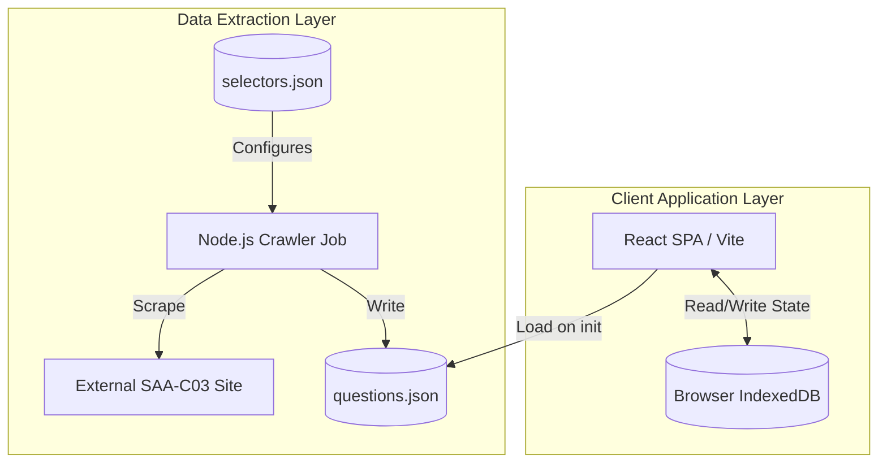
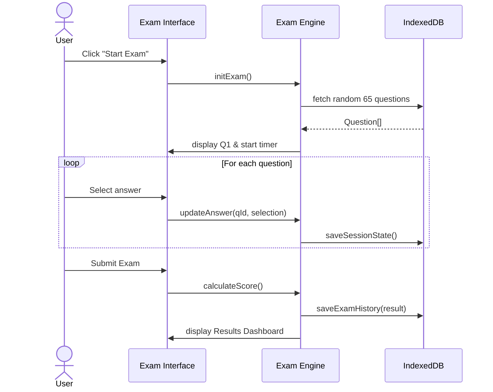

# Technical Design: AWS SAA-C03 Prep System

## Overview
**Purpose**: This feature delivers a fully offline-capable, client-side web application for practicing AWS SAA-C03 certification exams.
**Users**: A single individual learner preparing for the exam.
**Impact**: Creates a local environment where users can take mock exams, review detailed explanations, and track their performance without needing backend services or internet connectivity (after the initial data load).

### Goals
- Provide a robust mock exam engine replicating the 65-question / 130-minute SAA-C03 format.
- Offer immediate feedback and "tricks" for effective learning.
- Ensure progress is saved persistently in the browser.
- Deliver an automated crawler script to seed the question bank.

### Non-Goals
- Multi-user authentication and authorization.
- Cloud synchronization or backup (data stays local to the device).
- Complex backend server infrastructure.

## Architecture

### Architecture Pattern & Boundary Map
**Client-Side SPA with IndexedDB + Offline Scraper**
The system is divided into two distinct boundaries:
1. **Offline Scraper**: A Node.js CLI tool that runs on the user's machine. It uses a `selectors.json` configuration file to fetch questions from a target source and outputs a static `questions.json` file.
2. **React SPA**: A web application that reads the static JSON file, loads it into IndexedDB, and manages all exam logic and progress tracking purely on the client side.



### Technology Stack

| Layer | Choice / Version | Role in Feature | Notes |
|-------|------------------|-----------------|-------|
| Frontend | React + Vite + TypeScript | UI and Exam Logic | Fast build, standard SPA |
| State/Storage | IndexedDB (via `dexie` or `idb`) | Persistent storage | Handles large JSON datasets and exam history without 5MB limits |
| Data Extraction | Node.js + Puppeteer | Web scraping job | Headless browser for dynamic DOM |

## Canonical Contracts & Invariants

| Contract Area | Canonical Decision | Applies To | Must Stay Consistent In |
|---------------|--------------------|------------|-------------------------|
| Data / persistence | IndexedDB is the source of truth for exam history and question bank | Client SPA | All data reads/writes |
| Generated artifacts | Crawler must output `questions.json` in a specific schema | Crawler | Data extraction logic |

## System Flows

### Exam Session Flow


## Requirements Traceability

| Requirement | Summary | Components | Interfaces | Flows |
|-------------|---------|------------|------------|-------|
| 1.1 - 1.5 | Data Crawling Job | ScraperCLI | `CrawlerConfig`, `QuestionSchema` | Extraction Flow |
| 2.1 - 2.5 | Mock Exam Engine | ExamEngine, TimerService | `ExamSession`, `Question` | Exam Session Flow |
| 3.1 - 3.4 | Learning Experience | QuestionCard, FeedbackPanel | `Explanation`, `Trick` | Exam Session Flow |
| 4.1 - 4.4 | Progress Tracking | HistoryService, Dashboard | `ExamHistory`, `Stats` | Exam Session Flow |
| 5.1 - 5.2 | Performance | IndexedDB Service | `IDBAdapter` | - |
| 6.1 - 6.2 | Reliability | SessionAutoSaver | `ExamSession` | Exam Session Flow |

## Components and Interfaces

### Data Layer

#### ScraperCLI
| Field | Detail |
|-------|--------|
| Intent | Extracts questions from external websites and generates `questions.json` |
| Requirements | 1.1, 1.2, 1.3, 1.4, 1.5, 5.2 |

**Contracts**: Batch [x]

##### Batch / Job Contract
- Trigger: Manual CLI execution (`npm run scrape`)
- Input / validation: Reads `selectors.json` for target CSS classes.
- Output / destination: `public/data/questions.json`

##### Data Schema (Output)
```typescript
interface QuestionSchema {
  id: string; // Unique identifier/hash
  text: string;
  options: { id: string; text: string; isCorrect: boolean }[];
  explanation: string;
  trick?: string;
  domain?: string; // SAA-C03 domain
}
```

### Business Logic Layer

#### ExamEngine
| Field | Detail |
|-------|--------|
| Intent | Manages the lifecycle of a mock exam, including timer, selection, and scoring |
| Requirements | 2.1, 2.2, 2.3, 2.4, 2.5, 6.1, 6.2 |

**Dependencies**
- Outbound: `StorageService` — Persist active session (P0)

**Contracts**: State [x]

##### Service Interface
```typescript
interface ExamSession {
  sessionId: string;
  startTime: number;
  remainingSeconds: number;
  questions: QuestionSchema[];
  answers: Record<string, string[]>; // questionId -> selected optionIds
  markedForReview: string[];
  isCompleted: boolean;
  score?: number;
}

interface ExamEngineService {
  startExam(): Promise<ExamSession>;
  resumeExam(sessionId: string): Promise<ExamSession>;
  selectAnswer(questionId: string, optionIds: string[]): void;
  markReview(questionId: string, isMarked: boolean): void;
  submitExam(): Promise<ExamResult>;
}

interface ExamResult {
  score: number;
  totalCorrect: number;
  totalQuestions: number;
  passed: boolean; // >= 72% for SAA-C03
}
```

#### StorageService
| Field | Detail |
|-------|--------|
| Intent | Wrapper around IndexedDB for fast local read/write |
| Requirements | 1.2, 4.1, 4.2, 4.3, 4.4, 5.1 |

**Implementation Notes**
- Integration: Use Dexie.js for easier IndexedDB querying.
- Validation: Ensure schema matches `QuestionSchema`.
- Risks: Browser storage eviction. Mitigation: Implemented Export/Import JSON data feature (Req 4.4).

## Data Models

### Logical Data Model

**Question (Read-Only in App)**
- `id`: string (PK)
- `text`: string
- `options`: array
- `explanation`: string
- `trick`: string

**ExamHistory**
- `id`: string (PK)
- `date`: number (timestamp)
- `score`: number
- `totalQuestions`: number
- `timeSpentSeconds`: number

**ActiveSession**
- Contains exactly 1 record. Stores the JSON of the current `ExamSession` for recovery.

## Error Handling

### Error Strategy
**User Errors**: Missing JSON data -> "Please run the crawler job first and ensure `questions.json` is generated".
**System Errors**: IndexedDB unavailable (e.g., Firefox Private Mode) -> Graceful degradation to memory (or warning the user that progress won't be saved).

## Testing Strategy
- Unit Tests: `ExamEngine` scoring logic, timer formatting.
- Integration Tests: `StorageService` read/write with fake IndexedDB.
- E2E: Complete exam flow from start to submit.
